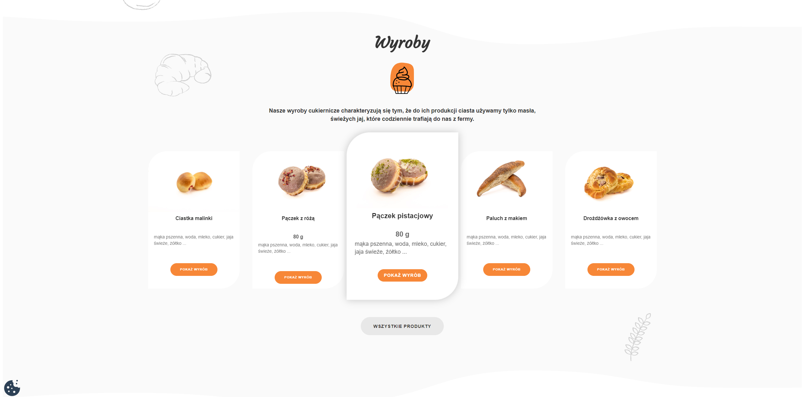

# mod_hikashop_carousel (HikaShop Carousel)

Moduł Joomla wyświetlający karuzelę produktów HikaShop (UIkit Slider) z własnym CSS/JS.



## Wymagania
- Joomla 4/5
- HikaShop (produkty pobierane z tabeli `#__hikashop_product`)
- UIkit w szablonie (moduł używa atrybutów `data-uk-slider`)

## Instalacja
1. Pobierz paczkę ZIP (np. z zakładki Releases, jeśli ją dodasz) albo zbuduj ją samodzielnie.
2. W Joomla: **Rozszerzenia  Zarządzanie  Instaluj**.
3. Wgraj ZIP.

## Konfiguracja modułu

### Treści sekcji
- **Tytuł**  nagłówek nad karuzelą.
- **Obraz pod tytułem sekcji**  ikonka/obrazek pod nagłówkiem.
- **Krótki opis**  treść pod tytułem (edytor).

### Wygląd tła (2 elementy)
W module możesz ustawić dwa obrazy tła, pozycjonowane dekoracyjnie:
- **Obraz w tle lewa/góra**  element w lewym górnym rogu sekcji.
- **Obraz w tle prawy/dół**  element w prawym dolnym rogu sekcji.

### Przycisk na dole sekcji
- **Tekst przycisku na dole sekcji**  jeśli pole jest puste, przycisk nie wyświetla się na froncie.
- **Pozycja menu (Itemid)  dokąd prowadzi przycisk**  wybór pozycji menu pojawia się dopiero, gdy tekst przycisku nie jest pusty. Ustawia stronę docelową dla przycisku; ten sam `Itemid` jest też używany w linkach kart produktów dla spójnego routingu.

### Długość opisu
- **Długość tekstu w opisie produktów**  limit znaków dla opisu na kartach w karuzeli.

## Jak to działa (technicznie)
- Moduł używa własnego dispatchera (`src/Dispatcher/Dispatcher.php`) rejestrowanego przez `services/provider.php`.
- Layout jest renderowany przez `tmpl/default.php`.
- Assety (CSS/JS) są ładowane przez `media/joomla.asset.json`:
  - CSS: `media/css/custom.css`
  - JS: `media/js/custom.js`

## Struktura paczki
W paczce instalacyjnej powinny znajdować się:
- `mod_hikashop_carousel.xml`
- `script.php`
- `services/`
- `src/`
- `tmpl/`
- `media/` (w środku: `css/`, `js/`, `joomla.asset.json`)

## Budowanie ZIP lokalnie (Windows / PowerShell)
Przykład (dopasuj ścieżki):
```powershell
$workDir = "C:\path\to\mod_hikashop_carousel"  # katalog z plikami paczki
$zipPath = "C:\path\to\mod_hikashop_carousel.zip"
Compress-Archive -Path (Join-Path $workDir '*') -DestinationPath $zipPath -Force
```

## Licencja
Uzupełnij zgodnie z tym, jak chcesz publikować moduł (np. GPL-2.0-or-later).

